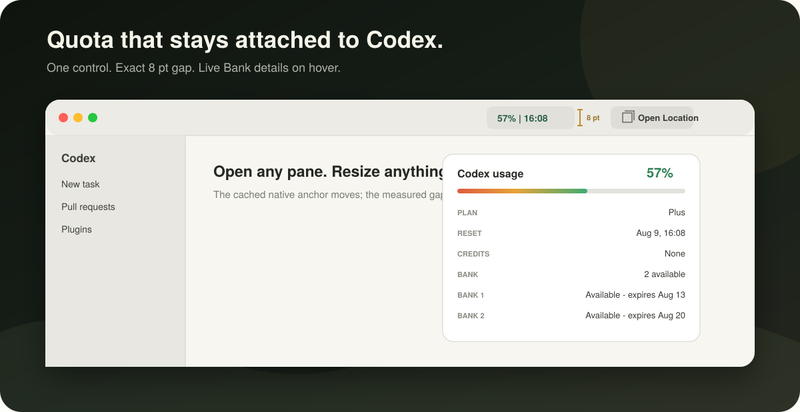
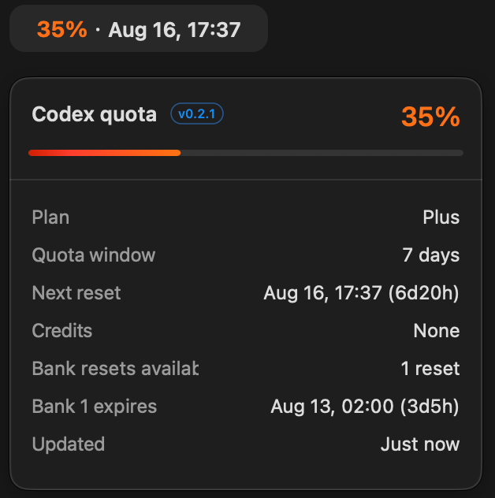
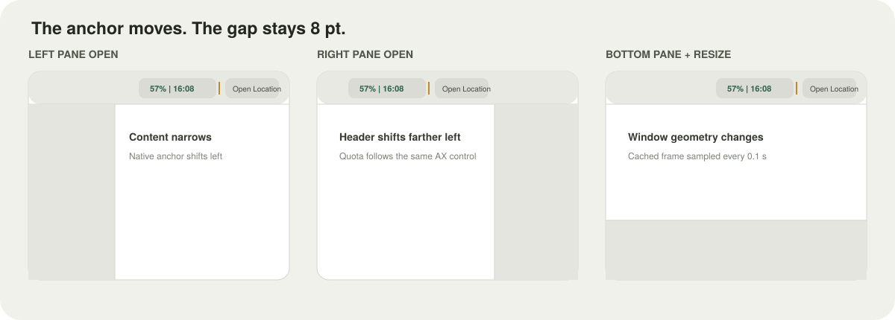

<p align="center">
  
</p>

<h1 align="center">Codex Usage Sidebar</h1>

<p align="center">
  Live Codex quota, reset time, Credits, and Bank details beside the native Open Location control.
</p>

<p align="center">
  <a href="README.zh-CN.md">简体中文</a> ·
  <a href="docs/INSTALL.md">Install</a> ·
  <a href="docs/INSTALL_FOR_AGENTS.md">Install with an agent</a> ·
  <a href="docs/TROUBLESHOOTING.md">Troubleshooting</a>
</p>

<p align="center">
  <a href="https://github.com/JaceHwang/codex-usage-sidebar/actions/workflows/ci.yml"></a>
  <a href="https://github.com/JaceHwang/codex-usage-sidebar/releases"></a>
  <a href="LICENSE"></a>
  
  
</p>

> [!NOTE]
> This is an independent community project and is not affiliated with or endorsed by OpenAI.

## Actual appearance

<p align="center">
  
  
</p>

<p align="center"><em>Light theme · Dark theme</em></p>

<p align="center">Real v0.2.1 captures showing the titlebar indicator and full quota popover.</p>

## What it does

Codex Usage Sidebar installs a small native macOS companion outside the signed Codex application.
It reads quota updates from Codex's local `app-server`, follows the current light or dark theme,
and renders one non-activating control exactly 8 points before the native Open Location button.

| Situation | Behavior |
| --- | --- |
| Left, right, or bottom pane changes | The quota control follows the native **Open Location** control and keeps an exact 8-point gap. |
| Window moves or resizes | A cached accessibility anchor is sampled every 0.1 seconds, so the control tracks the new position. |
| Hover | A native detail card shows the synchronized plugin version, plan, period, Credits, and every Bank entry with status and expiry. |
| Click | The detail card stays pinned until the quota control is clicked again; hover behavior remains available. |
| Quota changes | Percentage color follows the exact 100% green, 49% orange, and 10% red palette while the filled bar reveals the matching spectrum. |
| Codex language changes | The control and detail card follow Codex's effective Simplified Chinese, Traditional Chinese, or English locale within one second. |

The old sidebar-footer copy and all sidebar-state synchronization code are removed. There is only one
quota control.

<p align="center">
  
</p>

## Quick install

Requirements: Codex desktop for macOS, macOS 14 or later, Apple Silicon, and the `codex` CLI.

```bash
codex plugin marketplace add JaceHwang/codex-usage-sidebar
codex plugin add codex-usage-sidebar@codex-usage-sidebar
```

Start a **new Codex task** after installation. Codex loads plugins at the task boundary, and the
`SessionStart` hook installs and starts the companion. This follows the same task-boundary model
described in the [official Codex plugin workflow](https://developers.openai.com/learn/developers-codex-plugin/).

The companion uses its own Codex home so it never copies credentials from your normal `~/.codex`.
Authorize that isolated home once:

```bash
env CODEX_HOME="$HOME/Library/Application Support/CodexUsageSidebar/CodexHome" codex login
```

Then enable Accessibility for **Codex Usage Sidebar** when macOS asks. See
[Installation and operations](docs/INSTALL.md) for exact status, update, repair, and removal steps.

## Fixed positioning

The companion does not estimate placement from the window edge. It finds the real Open Location
button by its accessibility title, description, help text, or identifier, then lays out:

```text
quota.maxX = openLocation.minX - 8 pt
```

After the first semantic scan, the AX element is cached. Pane changes and window resizing only
require reading that element's current frame. If the named control is temporarily unavailable, the
companion preserves a safe in-window fallback rather than touching Codex internals.

## Live details

- Remaining percentage and next reset time are always visible in the compact control.
- A compact outlined badge beside the quota-card title reads the app bundle version, so the
  visible UI and installed code can be identified without opening a terminal.
- The hover card includes plan, period, Credits, Bank availability, every Bank credit, expiry, and
  status.
- The compact and hover percentages use the same continuously interpolated state color:
  `100%` green, `49%` orange, and `10%` red.
- The progress fill clips a fixed red-to-orange-to-green spectrum to the live remaining percentage;
  the unused portion stays theme-aware neutral gray.
- Local notifications update the display immediately; bounded refresh and stream recovery protect
  against missed updates.

## Language matching

Version 0.2.1 follows the language Codex is actually displaying. An explicit Codex language choice
is authoritative; when Codex is set to **Auto**, the running renderer's resolved locale is used.
Codex preferences and the macOS preferred language remain safe startup fallbacks.

| Effective Codex locale | Plugin UI |
| --- | --- |
| Simplified Chinese (`zh-Hans`, `zh-CN`, `zh-SG`) | 简体中文 |
| Traditional Chinese (`zh-Hant`, `zh-TW`, `zh-HK`, `zh-MO`) | 繁體中文 |
| English (`en-*`) | English |
| Any other locale | English |

There is no separate plugin language switch. The companion checks the effective locale every
second, so both a visible and a click-pinned detail card update without reinstalling the plugin.

## Why it survives Codex upgrades

- The companion lives in `~/Library/Application Support/CodexUsageSidebar/`, outside the official
  app bundle.
- A user LaunchAgent keeps it running across Codex restarts.
- Host discovery finds the currently running `com.openai.codex` bundle and its current
  `codex app-server` executable.
- Plugin updates fingerprint and atomically replace the companion; Codex app upgrades cannot
  overwrite it.
- The copied payload is re-signed with the stable local identity when available, keeping the same
  Accessibility code identity across plugin reinstalls.
- Repair remains one command:

```bash
"$HOME/Library/Application Support/CodexUsageSidebar/sidebar-control.sh" repair
```

macOS remains the authority for Accessibility approval and may ask again after a security-policy or
signature change.

## Privacy and security

- Reads quota snapshots from the local Codex `app-server` process over stdio.
- Uses an isolated `CodexHome`; credentials are created by the official `codex login` flow.
- Does not scrape web pages, inject into Codex, read conversation text, or send telemetry.
- Reads only the running Codex renderer's locale argument in memory for language matching; raw
  process arguments are never written to diagnostics or logs.
- Reads only the active Codex window and named control geometry for placement.
- Keeps runtime files under the user's Application Support directory.

Read the complete [privacy model](docs/PRIVACY.md), [architecture](docs/ARCHITECTURE.md), and
[security policy](SECURITY.md).

## Status and diagnostics

```bash
"$HOME/Library/Application Support/CodexUsageSidebar/sidebar-control.sh" status
```

A healthy precise-positioning result includes the state from the actual LaunchAgent process:

```text
pid=12345 version=0.2.1 runtime=shown placement=content-header anchor=openLocation
language=simplifiedChinese language_source=process
indicator=1524,1003,164,46 ... cached:true,source:openLocation,edge:1696
installed and loaded: .../Codex Usage Sidebar.app
```

The indicator's right edge must equal `edge - 8`. `cached:true` confirms the fast path is following
the already-resolved Open Location element. The runtime version must match the badge in the hover
card.

## Build provenance

The marketplace companion is promoted from the exact artifact produced by GitHub Actions.
[`assets/PROVENANCE.json`](plugins/codex-usage-sidebar/assets/PROVENANCE.json) records the source
commit, workflow run, artifact digest, archive digest, executable SHA-256, and code-directory hash.
CI verifies the pinned payload before independently rebuilding and testing the source.

## Development

```bash
cd plugins/codex-usage-sidebar
bash scripts/build-companion.sh
bash tests/test-sidebar-control.sh
bash tests/test-signing-identity.sh
bash tests/live-app-server-probe.sh   # requires isolated CodexHome login

cd ../..
CUS_ALLOW_SOURCE_AHEAD=1 bash scripts/validate-public-repo.sh
```

The build runs the complete Swift suite, produces an arm64 release app, selects the stable local
signing identity when available, and otherwise applies the deterministic ad-hoc requirement used by
CI. See [CONTRIBUTING.md](CONTRIBUTING.md) before opening a pull request.

## Documentation

- [Human installation and operations](docs/INSTALL.md)
- [Agent installation playbook](docs/INSTALL_FOR_AGENTS.md)
- [Architecture](docs/ARCHITECTURE.md)
- [Troubleshooting](docs/TROUBLESHOOTING.md)
- [Privacy](docs/PRIVACY.md)
- [Support](SUPPORT.md)
- [Changelog](CHANGELOG.md)

## License

[MIT](LICENSE) © 2026 Jace
