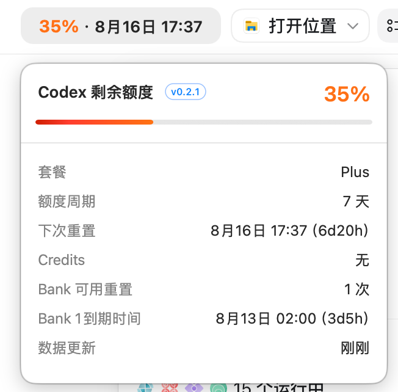
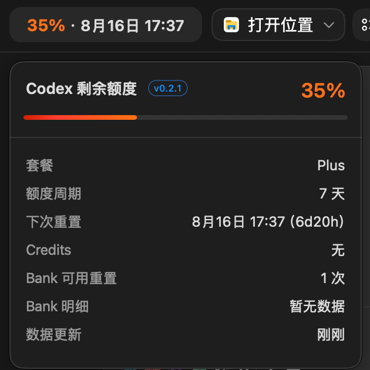

<p align="center">
  
</p>

<h1 align="center">Codex Usage Sidebar</h1>

<p align="center">在“打开位置”左侧实时显示剩余额度、重置时间、Credits 与 Bank 明细。</p>

<p align="center">
  <a href="README.md">English</a> ·
  <a href="docs/INSTALL.md">安装运维</a> ·
  <a href="docs/INSTALL_FOR_AGENTS.md">交给 Agent 安装</a> ·
  <a href="docs/TROUBLESHOOTING.md">故障排查</a>
</p>

> [!NOTE]
> 这是独立社区项目，与 OpenAI 无隶属关系，也不代表 OpenAI 官方背书。

## 当前实际效果

<p align="center">
  
  
</p>

<p align="center"><em>浅色主题 · 深色主题</em></p>

<p align="center">v0.2.1 实机截图，完整展示标题栏按钮与剩余额度浮窗。</p>

## 功能效果

Codex Usage Sidebar 会在 Codex 官方应用包之外安装一个轻量原生伴随程序。它从本机
`app-server` 读取额度更新，跟随白天/黑夜主题，并在原生“打开位置”按钮左侧 8 点处显示额度按钮。

| 场景 | 表现 |
| --- | --- |
| 打开或关闭左、右、下侧栏 | 直接跟随原生“打开位置”按钮，始终保持精确 `8pt` 间隔。 |
| 移动或缩放窗口 | 每 `0.1 秒`读取缓存锚点的新坐标，额度按钮同步移动。 |
| 鼠标悬浮 | 展示同步的插件版本、套餐、额度周期、Credits、全部 Bank 次数、状态与过期时间。 |
| 鼠标点击 | 浮窗保持常驻，再次点击收回；原有悬浮查看方式继续保留。 |
| 剩余额度变化 | 百分比严格按 100% 绿、49% 橙、10% 红连续过渡，已填充进度显示对应光谱。 |
| Codex 语言变化 | 按 Codex 最终显示语言在 1 秒内切换简体中文、繁体中文或英文。 |

旧版左侧栏底部副本以及所有侧栏状态同步代码均已删除，现在只有顶部这一个额度按钮。

<p align="center">
  
</p>

## 快速安装

要求：macOS 14+、Apple Silicon、Codex 桌面版与 `codex` CLI。

```bash
codex plugin marketplace add JaceHwang/codex-usage-sidebar
codex plugin add codex-usage-sidebar@codex-usage-sidebar
```

安装后请新建一个 **Codex 任务**。Codex 会在任务开始时加载插件，`SessionStart` hook 随后
自动安装并启动伴随程序；这与[官方 Codex 插件流程](https://developers.openai.com/learn/developers-codex-plugin/)
描述的任务边界一致。

插件使用独立 CodexHome，不会复制普通 `~/.codex` 中的凭据。首次安装需单独授权一次：

```bash
env CODEX_HOME="$HOME/Library/Application Support/CodexUsageSidebar/CodexHome" codex login
```

之后按 macOS 提示，为 **Codex Usage Sidebar** 开启“辅助功能”。完整状态检查、更新、修复与
卸载步骤见[安装运维说明](docs/INSTALL.md)。

## 固定间距原理

伴随程序不再根据窗口边缘估算位置，而是通过无障碍标题、描述、帮助文本或标识符找到真正的
“打开位置”按钮，然后执行固定布局：

```text
额度按钮.maxX = 打开位置按钮.minX - 8pt
```

首次语义扫描后会缓存该 AX 控件。打开侧栏或缩放窗口时，只需读取它的新 frame，因此不会再
被聊天内容中的复制按钮或其他标题栏控件误导。若原生按钮短暂不可用，则回退到窗口内安全位置，
不会修改 Codex 内部代码。

## 实时额度明细

- 紧凑按钮始终展示剩余百分比和下次重置时间。
- `Codex 剩余额度` 后方的小型蓝色描边徽标直接读取 App Bundle 版本，方便不打开终端就
  判断当前实际运行代码。
- 悬浮卡片展示套餐、额度周期、Credits、Bank 可用次数、每一条 Bank 额度、状态和过期时间。
- 按钮百分比和悬浮百分比共用连续状态色：`100%` 绿色、`49%` 橙色、`10%` 红色。
- 已填充进度条从固定的红→橙→绿光谱中按实时额度裁切，未填充部分保持主题自适应灰色。
- 本地通知到达后立即更新，并带有有界刷新、重置检查与数据流恢复机制。

## 语言自动匹配

v0.2.1 直接跟随 Codex **最终实际显示的语言**。Codex 明确选择的语言优先；设为“自动”时，
插件跟随运行中的 Codex 渲染进程语言。Codex 偏好设置与 macOS 首选语言仅作为启动阶段的安全回退。

| Codex 最终语言 | 插件显示 |
| --- | --- |
| 简体中文（`zh-Hans`、`zh-CN`、`zh-SG`） | 简体中文 |
| 繁体中文（`zh-Hant`、`zh-TW`、`zh-HK`、`zh-MO`） | 繁體中文 |
| 英文（`en-*`） | English |
| 其他语言 | English |

插件不再提供一套独立语言设置，避免与 Codex 不一致。伴随程序每秒检查一次有效语言；已显示或
点击固定的浮窗也会原地更新，无需重新安装插件。

## 为什么 Codex 升级后仍能用

- 伴随程序位于 `~/Library/Application Support/CodexUsageSidebar/`，不在官方应用包中。
- 用户级 LaunchAgent 负责常驻与自动重启。
- 每次运行都会重新发现当前 `com.openai.codex` 和对应的 `codex app-server`。
- 插件更新先校验载荷指纹再原子替换，Codex 官方升级不会覆盖它。
- 安装器会优先使用稳定的本地签名身份重新签署复制后的载荷，使插件重装前后的“辅助功能”
  代码身份保持稳定。
- 修复仍然只需一个命令：

```bash
"$HOME/Library/Application Support/CodexUsageSidebar/sidebar-control.sh" repair
```

“辅助功能”的最终授权始终由 macOS 决定；系统安全策略或签名发生变化时仍可能要求再次确认。

## 隐私与安全

- 只通过 stdio 从本机 Codex `app-server` 读取额度快照。
- 使用隔离的 `CodexHome`，凭据仅由官方 `codex login` 流程创建。
- 不抓网页、不注入 Codex、不读取聊天正文、不上传遥测。
- 只在内存中读取 Codex 渲染进程的语言参数用于匹配；原始进程参数不会写入诊断或日志。
- 只读取当前 Codex 窗口与目标控件的几何信息用于定位。
- 运行文件只保存在用户的 Application Support 目录。

详见[隐私说明](docs/PRIVACY.md)、[架构说明](docs/ARCHITECTURE.md)和[安全策略](SECURITY.md)。

## 状态诊断

```bash
"$HOME/Library/Application Support/CodexUsageSidebar/sidebar-control.sh" status
```

精确定位正常时会返回常驻 LaunchAgent 进程的真实状态：

```text
pid=12345 version=0.2.1 runtime=shown placement=content-header anchor=openLocation
language=simplifiedChinese language_source=process
indicator=1524,1003,164,46 ... cached:true,source:openLocation,edge:1696
installed and loaded: .../Codex Usage Sidebar.app
```

额度按钮右边缘应等于 `edge - 8`。`cached:true` 表示已经进入缓存控件快速跟随路径；状态中的
版本号还应与悬浮卡片徽标一致。

## 构建来源证明

Marketplace 分发的伴随程序来自 GitHub Actions 的精确产物。
[`assets/PROVENANCE.json`](plugins/codex-usage-sidebar/assets/PROVENANCE.json) 记录源码提交、工作流、
Artifact 摘要、压缩包摘要、可执行文件 SHA-256 与代码目录哈希。CI 会先验证固定产物，再独立
重建并运行测试。

## 开发验证

```bash
cd plugins/codex-usage-sidebar
bash scripts/build-companion.sh
bash tests/test-sidebar-control.sh
bash tests/test-signing-identity.sh
bash tests/live-app-server-probe.sh   # 需要先登录隔离 CodexHome

cd ../..
CUS_ALLOW_SOURCE_AHEAD=1 bash scripts/validate-public-repo.sh
```

完整 Swift 测试、arm64 Release 构建、签名选择与严格签名校验均由构建脚本执行。提交 PR 前请
阅读 [CONTRIBUTING.md](CONTRIBUTING.md)。

## 文档索引

- [安装与运维](docs/INSTALL.md)
- [Agent 安装流程](docs/INSTALL_FOR_AGENTS.md)
- [架构](docs/ARCHITECTURE.md)
- [故障排查](docs/TROUBLESHOOTING.md)
- [隐私](docs/PRIVACY.md)
- [支持](SUPPORT.md)
- [更新记录](CHANGELOG.md)

## 许可证

[MIT](LICENSE) © 2026 Jace
