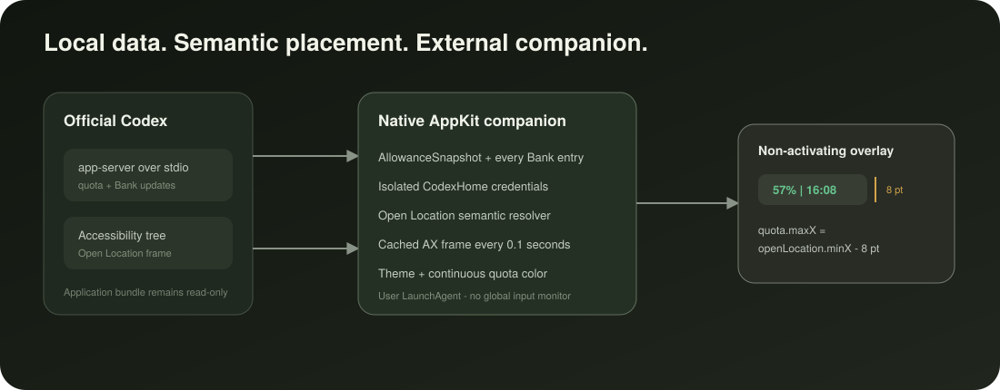

# Architecture

<p align="center">
  
</p>

## Components

1. **Marketplace plugin** provides the installable manifest, skill, and `SessionStart` hook.
2. **Control script** atomically installs, repairs, reports, and removes the user LaunchAgent.
3. **Native AppKit companion** runs outside Codex and renders a non-activating quota panel.
4. **SidebarCore** contains pure rate-limit decoding, formatting, color, layout, transport, and
   anchor-resolution logic covered by Swift tests.

## Data flow

```text
Codex app-server over stdio
        |
        v
AllowanceSnapshot + Bank entries
        |
        v
Native AppKit companion
        |
        v
Open Location semantic AX lookup
        |
        v
cached AX element sampled every 0.1s
        |
        v
quota.maxX = openLocation.minX - 8pt
```

The companion discovers the running `com.openai.codex` bundle and launches its current
`codex app-server` executable over local stdio with an isolated `CODEX_HOME`. JSON-RPC initialization,
rate-limit reads, notifications, refresh recovery, and reset checks produce an `AllowanceSnapshot`.

Language resolution is independent from quota transport:

```text
running Codex renderer --lang
        |
        v
Codex Preferences fallback
        |
        v
macOS preferred-language fallback
        |
        v
Simplified Chinese / Traditional Chinese / English
        |
        v
localized compact control + detail card
```

The running renderer argument is the final effective locale, so it also reflects Codex's resolved
choice when the application setting is Auto. A script subtag takes precedence over a region;
unsupported locales map to English. Raw process arguments are used in memory only and are never
persisted.

## Placement

The accessibility scan selects the Codex AX window that best matches the active Quartz window. It
walks the right half of the tree, pruning left-side branches, and recognizes Open Location through
its title, description, help text, or identifier in English or Chinese.

After the first match, the AX window and element are cached. The 0.1-second position loop reads only
the cached element frame and repositions the overlay, which keeps the gap stable while the left,
right, or bottom pane opens, the window resizes, or the window moves.

If the exact target is unavailable, pure resolver fallbacks can use another labeled header control,
the right-pane boundary, or a safe in-window edge. Diagnostics expose the selected source. The
runtime has no sidebar-state model, global key monitor, global mouse monitor, or code injected into
Codex.

## Rendering and freshness

The compact control and hover panel are native AppKit surfaces. They follow the Codex theme and do
not activate or replace native controls. Both percentage labels use one HSB state-color function
with exact anchors at 100% green, 49% orange, and 10% red. The progress fill clips a fixed AppKit
gradient with stops at 0%, 10%, 49%, and 100% across the full track. The hover header also reads
`CFBundleShortVersionString` into a compact outlined badge. The detail model includes plan, period,
Credits, aggregate Bank availability, and every Bank entry with expiry and status.

Hover shows the detail card transiently. Clicking the quota control pins the same card; clicking
again dismisses it. A one-second language check re-renders visible content from the current
snapshot without changing interaction state or triggering an app-server refresh.

App-server notifications update the snapshot immediately. Data dims after two minutes and hides
after five minutes; the client restarts stalled or exited streams and schedules bounded refreshes.

## Upgrade boundary

The official Codex bundle remains read-only. The companion, isolated Codex home, data, and
LaunchAgent live under the user's home directory. A Codex upgrade changes discovery input, not the
companion installation. A plugin upgrade fingerprints the source payload, copies it to a temporary
app, applies the stable local signing identity when available, verifies the result, and uses an
atomic rename before restarting the LaunchAgent.

The long-running process atomically publishes a sanitized `runtime-state.txt` containing PID,
bundle version, visibility, mapped language and source, anchor source, indicator frame, and
timestamp. `sidebar-control.sh status`
reports that file only when its PID matches the active LaunchAgent, avoiding misleading
results from a separate one-shot diagnostic process.

## Binary provenance

The marketplace app is promoted from a successful GitHub Actions artifact. `PROVENANCE.json` binds
it to the source commit, workflow run, artifact digest, archive digest, executable SHA-256, and code
directory hash. Validation checks the pinned executable and rejects unpromoted source on `main`.

## Safety properties

- Install and uninstall paths are validated before destructive operations.
- The official Codex application is never modified or re-signed.
- The app-server receives credentials only from the isolated `CodexHome` created by `codex login`.
- The accessibility reader inspects only Codex window and named-control geometry.
- Invalid windows, missing snapshots, background host state, and expired data hide the overlay.
